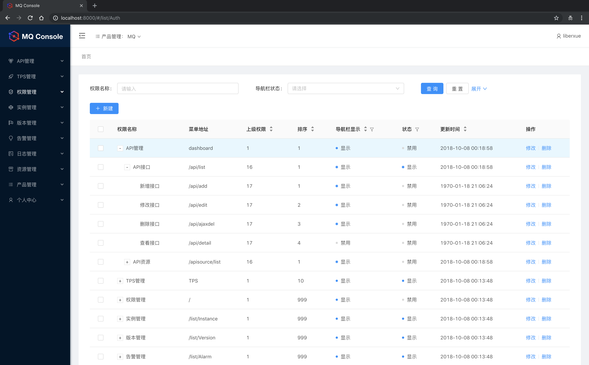

# ReactAdmin +Golang 

[](https://greenkeeper.io/)

English | [简体中文](./README.zh-CN.md)

# MQ Console




## Usage

```bash
$ git clone https://github.com/Liberxue/ReactAdmin --depth=1
$ cd mqconsole
$ npm install
$ npm start         # visit http://localhost:8000
```


